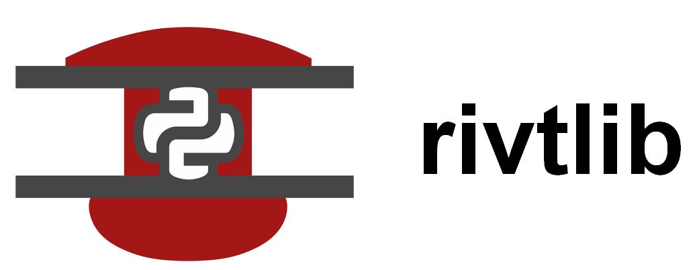
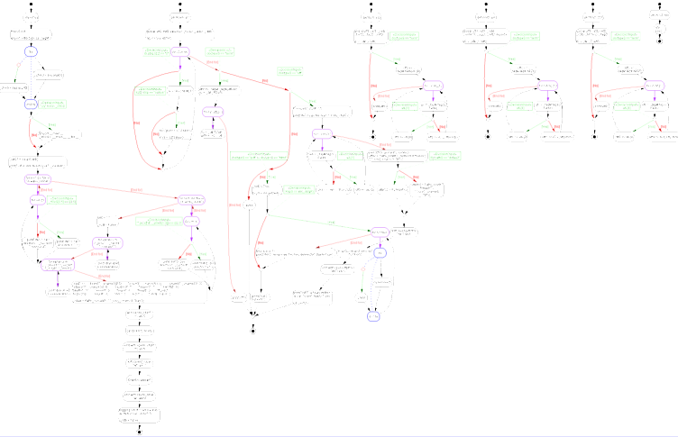

**Share Calcs Anywhere**

---------------------------

[link to **rivtlib** code on Github**](https://github.com/ShareCalcs/rivtlib)

[link to **rivt** user manual](https://github.com/ShareCalcs/rivtdocs)

[link to **rivt** installers](https://github.com/ShareCalcs/rivt)

## Introduction to **rivtlib** 

[link to **rivt** overview](https://rivt.info)

Open source tools for writing software can also be used to increase sharing and
collaboration when writing engineering calculation documents. 

**rivt** is an open source software stack for writing calculation documents. It
defines the **rivtText** markup language and a default installation that
includes **rivtlib**, **VSCode**, and **Github**. **rivtText** is a plain text,
human readable language built on restructuredText. It can be a standalone
calculation or included in any Python program. **rivtlib** is the Python
library and API that processes **rivtText**. **VSCode** and **Github** are the
extensible, customizable editor and searchable repository from Microsoft.

**Program Flow (rivt.py module)**

