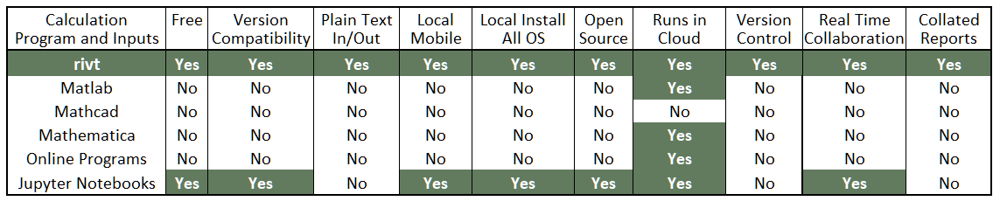

share calcs anywhere, anytime

---------------------------

**rivtlib code documentation menu (left or upper right)**

[link to **rivtlib** code on Github](https://github.com/ShareCalcs/rivtlib)

[link to **rivt** user manual](https://github.com/ShareCalcs/rivtdocs)

[link to **rivt** installers](https://github.com/ShareCalcs/rivtdocs)

## Introduction

Recent progress in open source software tools can be applied to reducing
barriers to sharing and collaborating on engineering calculations. They provide
an opportunity to improve production efficiency and quality. 

Because most engineering technologies are changing slowly, design procedures are
often fixed in codes for decades. The heart of engineering work lies in
understanding different, established, technologies and then skillfully and
efficiently combining them to fit project requirements. Shared calculations can
provide a first draft for many projects. The draft can then be edited and
adapted to fit the needs of a particular project. 

Engineering professions have an opportunity to produce large, general
calculation libraries that can be reused and recombined as needed.  The model of
shared incremental improvement in text documents (software code) has proven
effective in programming. The extension of this approach to engineering
calculations appears promising.

A number of powerful calculation programs exist, but they include barriers to
widespread sharing. These include high initial and recurring software costs.
Costs are further increased by changing file formats that require program
upgrades or subscriptions. File incompatibility between different programs
requires multiple software purchases. And current software does not produce
collated reports, or allow for version control or inclusion of information from
arbitrary sources often needed for clarity. 

Taken together these barriers prevent widespread sharing. Instead they lead to
nearly identical calculations being written thousands of times. **rivt** was
written as an an open source software stack to minimize these barriers and
promote sharing.

**Program Comparison**



## **rivt** Overview

**rivt** is an integration of three open source programs (listed below). It
implements **rivtText**, a plain text, human readable, calculation markup
language derived from restructuredText.  **rivtlib** is the Python library that
processes **rivtText**. **Github** repositories are the primary platform used to
search and distribute **rivt** calcs.

**rivt** can be installed on the desktop or run in the cloud.  The absolute
minimum software needed is a Python installation with 8 additional libraries and
a plain text processor. The basic installation required for efficient workflow
and formal document production includes: 

1. Python 3.8 or above + libraries
2. VSCode + extensions
3. LaTeX

**rivt** installers are available for every OS platforms.  It can also be run in
the cloud using GitHub CodeSpaces (or other cloud service providers).
Installation details are provided in the user manual ___here ____.


## **rivtlib** Overview

**rivtlib** is a Python package that provides a calculation API for **rivt**.
The API is file and folder based with a specified folder and naming convention.
The file, folder and prefix naming (italic shows optional) divide the
calculation report into modular, easily edited and shareable components. The
naming structure is also used to assemble calcs into a collated report. Folders
are shown bracketed and notes are in parenthesis.

**rivt Folder Structure**

- **[rivt*_user_project_name*]** (user project_name)
    - **[text]**
        - **[rv00*_user_config_name*]** (calc configuration data)
            - units.py
        - **[rv01*_user_calc_division_name1*]**  (folder report division name)
            - *rv0101*_calc_name1.py (calc file name) 
            - *rv0102*_calc_name2.py
            - *rv0101*_calc_name1.txt (text calc output file)
            - *rv0102*_calc_name2.txt
            - chart.csv (text file used in calc)
            - functions.py (function file used in calc)
         - **[rv02*_user_calc_division_name2*]**
            - rv0201_calc_name3.py
            - rv0202_calc_name4.py
            - rv0201_calc_name3.txt
            - rv0202_calc_name4.txt
            - paragraph.txt
   - **[docs]**
        - **[d00]** (project and report configuration data)
            - pdf_style.sty
            - config.txt
            - project_data.xlsx
        - **[d01]**
            - image1.jpg
        - **[d02]**
            - image2.jpg
            - attachment.pdf    
        - **[html]** (html calc output files)
            - **[resources]**
                - image1.png
                - image2.png
            - index.html
            - d0101_gravity.html
            - d0102_wind.html
            - d0201_gravity.html
            - d0202_wind.html
        - **[pdf]** (pdf calc output files)
            - d0101_gravity.pdf
            - d0102_wind.pdf
            - d0201_floor.pdf
            - d0202_roof.pdf
            - report.pdf
    - **[files]** (additional user resource files)
        - **[*user_folder_name*]**
            - info.txt 

The three top-level folder names (text, docs and files) are required. Other file
names are user determined using the specified prefixes. Underscores that
separate words in file and folder names are stripped out when used as calc and
division names in the report. The API is designed so that only files in the text
folder are uploaded for version control and sharing. They constitute the
essential core of the calculation - the text, equations, functions and tables.
Files in the docs folder are not shared and are typically binary files such as
images, pdf attachments and proprietary data (e.g. client contact information
and costs).

Files File type	File description rivt file (.py) input model written in RivtText
calc (.txt)	formatted UTF-8 output, written to screen and file doc (.pdf or
.html)	formatted HTML or PDF calc output written to a file report (.pdf)
collated PDF docs written to a file API Functions The rivtlib API consists of
five functions that take a rivt-string as input (only four produce output) and a
function that controls the output format. The library is imported with:

A rivt file is a Python file that imports rivtlib and calls functions on
rivt-strings. Rivt-strings are free-form plain text strings enclosed in triple
quotes that may include commands and tags defining the calculation.
 
rvcddnn_filename.py where dd is the division and folder number and ddnn is the
calc number.  The two subfolders under the project folder are calcs and docs.
The calcs folder includes all of the plain text input files and output calc
files (.txt and .tex). The docs folder includes all of the binary inputs (i.e.
images) and  calc documents (.pdf and .html).  The calcs folder contains only
plain text files.  This division of file types makes it easy to share and impose
version control on the primary calculation inputs. rivtlib includes functions
that automate sharing to GitHub.

A rivt project is started by copying the folder structure from a similar
existing project.  The calcs folder will always be available.  The docs folder
can be copied and derived from the calcs folder..  In summary, rivtlib reads
string functions in a .py file as input and outputs a plain text calculation to
the calcs folder.  Options are available to write pdf or html files and reports
to the docs folder   Functions are available to assemble complete project
reports from pdf files.

python -m rivtlib cddnn_filename.py

If a LaTeX distribution is installed, formatted PDF documents and reports can be
generated. Calculation writing is dramatically improved if a full-featured code
editor or IDE (i.e. VSCode) is used the calculations can be executed
interactively and in stages by tagging (# %%) the API functions as cells.
Execution steps include:

                   /--------------------------------\
                   |     Edit and run rivt file     |
                   |     or interactive cells.      |
                   |                                |
                   |    cell or function types:     |
                   |       R(), I(), V(), T()       |
                   \---------------||---------------/
                                   \/
+---------------+  +--------------------------------+  +-------------+
|   Process     |  |   Working in interactive IDE?  |  |  Process    |
|   cell to     |  |     (VSCode, Spyder, Pyzo)     |  |  file       |
|   terminal    <--+ YES                         NO +-->             |
+------+--------+  +--------------------------------+  +------+------+
       |           +================================+         |
       |           |    Write utf-8, reST, TeX      |         |
       +===========>    calc to file                <=========+
                   |================================|
                   +===============||===============+
                                   \/
+===============+  +--------------------------------+
| Write HTML    |  |                                |  /---------\
| or PDF doc    |  |         Write docs?            |  |   End   |
| files         <==+ YES                         NO +==>         |
|===============|  +--------------------------------+  \---------/
+=====+=========+
      |            +--------------------------------+  /---------\
      |            |         Write report?          |  |   End   |
      +============>               YES           NO +==>         |
                   +---------------||---------------+  \---------/
                                   \/
                   +================================+
                   |    Write PDF report file       |
                   |================================|
                   +================================+
RivtCalc may be installed by:

Locally installing and configuring the individual open source components.
Download and unzipping a pre-configured installation (Windows only).
Remotely installing as a cloud service in a container.
RivtCalc may also be installed on a remote server and run in a broswer. RivtConnect is the remote server framework and it is also available as a paid service Refer to the RivtCalc User Manual for details.

Rivt User Manual <http://www.rivtdocs.net>

Efficient IDE's
By far the most efficient way to write rivt files is with a full featured code editor or IDE like Microsoft VSCode. Use of VSCode is documented in the Rivt User Manual. When working in VSCode the rivt functions can be written and evaluated step by step and graphics can be output inline. Other effective editors include Pyzo and Spyder.

  - Interactive Development Environments (IDE)
  - Python and its scientific libraries
  - LaTex distributions
  - Local and cloud database and file systems

Because calc input is written in text they are easily stored and searched in a database.  Because it generates formal LaTeX output, calcs can be used for reports and building permit documentation.  on-c-e was started as part of a research and development effort to address factors contributing to the decades-long slide in construction productivity.  Calc inputs generate two searchable output formats; UTF-8 and PDF.  A UTF-8 calc is instantly generated and is intended for rapid design checks and iteration. It can be edited, annotated and inserted in other documents.  The same calc input can also produce PDF calcs formal reports and construction documents.  They include graphics and LaTeX math and.  
on-c-e writes formatted UTF-8 and PDF calcs. Sections 2 and 3 show example calc inputs and outputs.  Additional examples are provided in Appendix J and they can be browsed in the online database at on-c-e.org.  Compared to Mathematica ™, Mathcad ™ or MATLAB ™, on-c-e reduces the effort needed to publish and share calculations and insure that older models always run.  Compared to Excel ™ and hand calculations it improves legibility, search, review, navigation, organization and re-use.  
Calcs may also be interactively processed within Python interactive shells and notebooks including IEP, Komodo Edit  and IPython.  Multiple related PDF calcs may be organized in a project calc with title blocks, page numbers, table of contents and links. 


rivt is software for systematically writing engineering calculations and
    other documents. It includes an open source markup language and API written
    in Python. The rivt calculation input file is designed to be easily shared
    through version control ssytems e.g. GitHub. 
    
    The rivtlib API has five methods: R(rs), I(rs), V(rs), T(rs), X(rs); where
    rs represents a RivtText string. In interactive mode in an IDE (e.g.
    VSCode), each API method can made into a standard cell by adding a preceding
    #%%. Cells can be evaluated one at a time and the output is displayed
    interactively (utf8). In file or write mode the entire formatted calculation
    is written to disk as a calc (utf8) or doc (PDF).  rivt files and calcs are
    text files and are usually develoeped under version contol.  Doc files are
    PDF files that also include project specific information and images, which
    are typically not shared in their generic, executable form.
    
    RivtText may include commands, tags, reStructuredText (reST) and native
    Python code. Commands begin the line with || and process data files. Tags
    terminate a line with [tag]_ and format output. Tags also format  blocks of
    text starting with [tag]__ (double underscore) and terminale with a blank
    line. 


The fundamental on-c-e component is a calc input file ffcc.name.txt, where ffcc is the calc designation, ff is the two digit folder number, cc is the two digit calc number and name is a user-created calc name.  The calc designation is used for calc and project organization and must be unique in a project.  Calcs are stored in folders which in turn are stored in a project folder (Table 4). Standalone calcs do not require a folder structure but do require a leading calc designation. When a calc is run it produces the following output files in its folder (Figure 3, Table 2):
-	¬¬UTF-8 calc ffcc.name.calc.txt
-	Optional PDF calc ffccc.name.calc.pdf and temporary files (removed by default) 
-	IPython input file _equations.py for interactive analysis and database summaries
-	Execution log file _calclog.txt, also (partially) echoed to the terminal during execution
-	 Optional .rst, .tex, .log, .out, fls, fdb_latexmk – see Appendix F
-	Optional project calc project.pdf assembled from a specified set of division folders
  
Related calcs may be grouped in division folders. Calcs may incorporate other calcs in the project, external functions, data, and batch or script control files. Externally referenced files (i.e. figures) must be located in the calc folder, and external calcs must be located in a project division folder.  External files are identified by file name only.  The program recreates the full path name internally, which allows division folders to be moved to new projects without changing the calc.  The exceptions include those files processed by the file operation options r (read) and e (edit).  These two operations typically use files produced by other programs with their own preferred file structure.  To work with these files in their natural location a full path name is required (see file operations, Appendix B). 

A calc folder has the name ff.foldername where ff is the unique folder number.  Each project folder may contain up to 100 calc folders each with 100 models using unique numbers 00 to 99.  The project folder contains an optional project definition file that defines the structure of the project calculation documents. It may contain the project wide unit and PDF style definition files (unitc.py, once.sty) that override program defaults.  If unit and style definition files are also included in a calc folder they will override both the project folder and built-in defaults for those calcs. 

 
 ## **OnceX** Overview
 
 **OnceX** Google Groups are the distribution platform for all other calculation formats with binary inputs. 


Text can be **bold**, _italic_, or ~~strikethrough~~.

This is a normal paragraph following a header. GitHub is a code hosting platform for version control and collaboration. It lets you and others work together on projects from anywhere.

## Header 2

> This is a blockquote following a header.
>
> When something is important enough, you do it even if the odds are not in your favor.

### Header 3

```js
// Javascript code with syntax highlighting.
var fun = function lang(l) {
  dateformat.i18n = require('./lang/' + l)
  return true;
}
```

```ruby
# Ruby code with syntax highlighting
GitHubPages::Dependencies.gems.each do |gem, version|
  s.add_dependency(gem, "= #{version}")
end
```

#### Header 4

*   This is an unordered list following a header.
*   This is an unordered list following a header.
*   This is an unordered list following a header.

##### Header 5

1.  This is an ordered list following a header.
2.  This is an ordered list following a header.
3.  This is an ordered list following a header.

###### Header 6

| head1        | head two          | three |
|:-------------|:------------------|:------|
| ok           | good swedish fish | nice  |
| out of stock | good and plenty   | nice  |
| ok           | good `oreos`      | hmm   |
| ok           | good `zoute` drop | yumm  |

### There's a horizontal rule below this.

* * *

### Here is an unordered list:

*   Item foo
*   Item bar
*   Item baz
*   Item zip

### And an ordered list:

1.  Item one
1.  Item two
1.  Item three
1.  Item four

### And a nested list:

- level 1 item
  - level 2 item
  - level 2 item
    - level 3 item
    - level 3 item
- level 1 item
  - level 2 item
  - level 2 item
  - level 2 item
- level 1 item
  - level 2 item
  - level 2 item
- level 1 item


### Large image


### Definition lists can be used with HTML syntax.

<dl>
<dt>Name</dt>
<dd>Godzilla</dd>
<dt>Born</dt>
<dd>1952</dd>
<dt>Birthplace</dt>
<dd>Japan</dd>
<dt>Color</dt>
<dd>Green</dd>
</dl>

```
Long, single-line code blocks should not wrap. They should horizontally scroll if they are too long. This line should be long enough to demonstrate this.
```

```
The final element.
```
